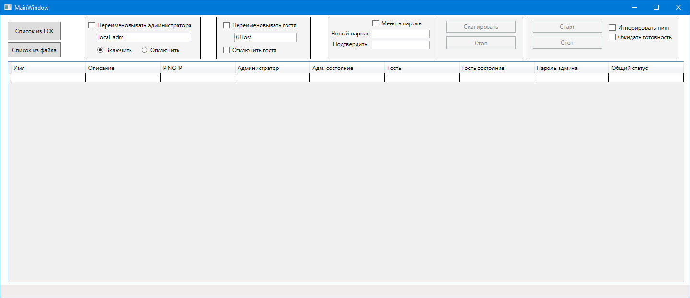

# GUIResetPwdAdmin
[Download here](https://github.com/Zud71/GUIResetPwdAdmin/releases)

## Программа по удаленному сбросу паролей локальных администраторов на рабочих станциях с графическим интерфейсом.
Версия не прошла боевые испытания, только тренировку на кошках. Требуются тестировщики.

#### Версия 1.0.0.6

Добавлено вывод дополнительных данных по УЗ на компьютерах:
- список администраторов
- список иных пользователей

В своей работе использует протокол ADSI WINT и имеет следующий функционал:

<em>

- удалённое подключение к рабочим станциям по протоколу  ADSI WINT 
- загрузка данных о рабочих станциях из AD или файла
- получение данных с рабочих станций о имени локального администратора, его состоянии
- получение данных с рабочих станций о имени гостевой учетной записи и ее состоянии
- вывод информации о доступности хоста
- возможность переименовать УЗ администратора и гостя
- возможность включить/выключить УЗ администратора, выключить гостя
- установить пароль администратора</li>
- реализована многопоточность т.е. все действия выполняются параллельно
- функция ожидания готовности всех компьютеров т.е. процедура смены пароля не остановиться пока на всех компьютерах из списка не пройдет смена пароля.
- работа с AD через LDAPS
</em>

#### В планах:
- исправление багов

Для работы требуется .NET Framework 4.5

**Для смены пароля и т.д. программу необходимо запускать от привилегированной УЗ имеющую права администратора на рабочих станциях.**
